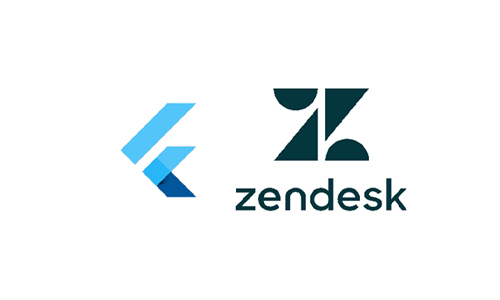

An Android and iOS SDK port of Zendesk for Flutter

Android min SDK 16 and iOS min OS Version 10.0

Easy and fast to use


<details>
  <summary>What you need</summary>
  
  * AccountKey (https://{yourcompanydomain}.zendesk.com/chat/agent#home > Profile Picture > Check Connection)

  * AppId (https://{yourcompanydomain}.zendesk.com/agent/admin/mobile_sdk)
 
  * Update Cocoapods to latest version

</details>

<details>
  <summary>STATUS</summary>
    
    * Chat SDK - OK
    
    * Support SDK - OK
    
    * Customization - OK
    
    * Answer SDK - OK

    * Unified SDK - OK

    * Talk SDK - PENDING DEVELOPMENT

</details>


# Chat SDK V2

```dart
/// Zendesk Chat instance
Zendesk2Chat z = Zendesk2Chat.instance;

/// Initialize Zendesk SDK
await z.init(accountKey, appId);

/// Optional Visitor Info information
await z.setVisitorInfo(
    name: name,
    email: email,
    phoneNumber: phoneNumber,
  );

/// Very important, for custom UI, prepare Stream for ProviderModel
await z.startChatProviders();

/// Get the updated provider Model from the SDK
_subscription = z.providersStream.listen((providerModel) {
  /// this stream retrieve all Chat data and Logs from the SDK
  /// in ONE unique reliable object :)
  _providerModel = providerModel;
});

/// It is also important to disconnect and reconnect 
/// and when the app enters and exits background, 
/// to do this you can simply calll
await z.disconnect();
/// or
await z.connect(); 

/// After you release resources
await z.dispose();
```


# Answer SDK

```dart

```

# Push Notifications

   To configure chat notifications, you will need to do the following configuration per platform

### iOS

  Inside your `AppDelegate.swift` import the ChatSDK as 
  
  ```swift
  import ChatProvidersSDK
  ```

  Add the following method
  ``` swift
    override func application(
      _ application: UIApplication, 
      didRegisterForRemoteNotificationsWithDeviceToken deviceToken: Data
    ) {
        // You might already have this if you are using firebase messaging
        // Messaging.messaging().apnsToken = deviceToken  
        
        Chat.registerPushToken(deviceToken)
    }
  ```
### Android

Using FCM messaging, get your FCM token and register it as follows:

``` dart
Zendesk2Chat z = Zendesk2Chat.instance;
await z.registerFCMToken(fcmToken);
```
(calling this function has no effect on iOS)

To display the notifications, you will need to register your own `FirebaseMessagingService` as a service inside the `application`. You can follow the Firebase Android Docs for this. An example file that you can copy and customize can be found in the main github repo. Overally you will add the file to your application and register the service as follows:

``` xml
<service
    android:name="{your package name}"
    android:stopWithTask="false">
    <intent-filter>
        <action android:name="com.google.firebase.MESSAGING_EVENT" />
    </intent-filter>
</service>
```
